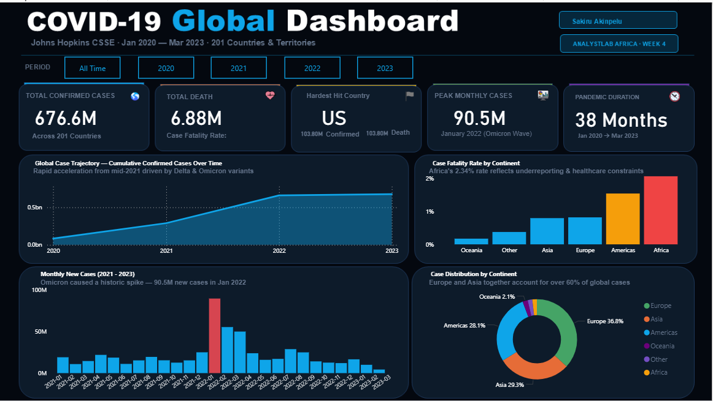

# 🦠 COVID-19 Global Dashboard — Power BI

## 📌 Project Overview
An interactive Power BI dashboard analyzing the global spread of COVID-19 from January 2020 to March 2023, using the Johns Hopkins CSSE dataset across 201 countries and territories.

---

## 📊 Dashboard Features

| Visual | Description |
|---|---|
| 🔢 Total Confirmed Cases | 676.6M cumulative cases globally |
| 💀 Total Deaths | 6.88M with Case Fatality Rate |
| 🌍 Hardest Hit Country | US — 103.8M confirmed |
| 📈 Peak Monthly Cases | 90.5M — January 2022 (Omicron Wave) |
| ⏱️ Pandemic Duration | 38 Months (Jan 2020 → Mar 2023) |
| 📉 Global Case Trajectory | Cumulative line chart over time |
| ☠️ CFR by Continent | Africa leads at 2.34% |
| 📅 Monthly New Cases | Column chart highlighting Omicron spike |
| 🍩 Case Distribution | Donut chart — Europe 36.8%, Asia 29.3% |

---

## 🗂️ Data Sources

- **Provider:** Johns Hopkins University CSSE
- **Files Used:**
  - `time_series_covid19_confirmed_global.csv`
  - `time_series_covid19_deaths_global.csv`
  - `time_series_covid19_recovered_global.csv`
- **Period:** January 2020 — March 2023
- **Coverage:** 201 Countries & Territories

---

## 🛠️ Tools Used

- **Power BI Desktop** — Dashboard & Visualizations
- **Power Query (M Language)** — Data Cleaning & Transformation
- **DAX** — Calculated Measures & KPIs

---

## 🧹 Data Cleaning Steps (Power Query)

1. Promoted headers and renamed identifier columns
2. Removed `Lat` and `Long` columns
3. Unpivoted date columns from wide to long format
4. Changed `Date` column to Date data type
5. Grouped by `Country_Region + Date` to eliminate province-level duplicates
6. Added `Continent` column via custom classification
7. Created `Month-Year` calculated column for time axis

---

## 📐 DAX Measures Created

- `Total Confirmed` — Latest cumulative confirmed cases
- `Total Deaths` — Latest cumulative deaths
- `Death Rate` — DIVIDE(Total Deaths, Total Confirmed)
- `Monthly New Cases` — Month-over-month new case calculation
- `Peak Monthly Cases` — Highest single month globally
- `Countries Affected` — DISTINCTCOUNT of countries with cases
- `CFR by Continent` — Fatality rate per continent

---

## 👤 Author

**Sakiru Akinpelu**
[GitHub](https://github.com/SakiruAkinpelu)

---

## 🏫 Context

This project was completed as part of **AnalystLab Africa — Week 4** internship program.
